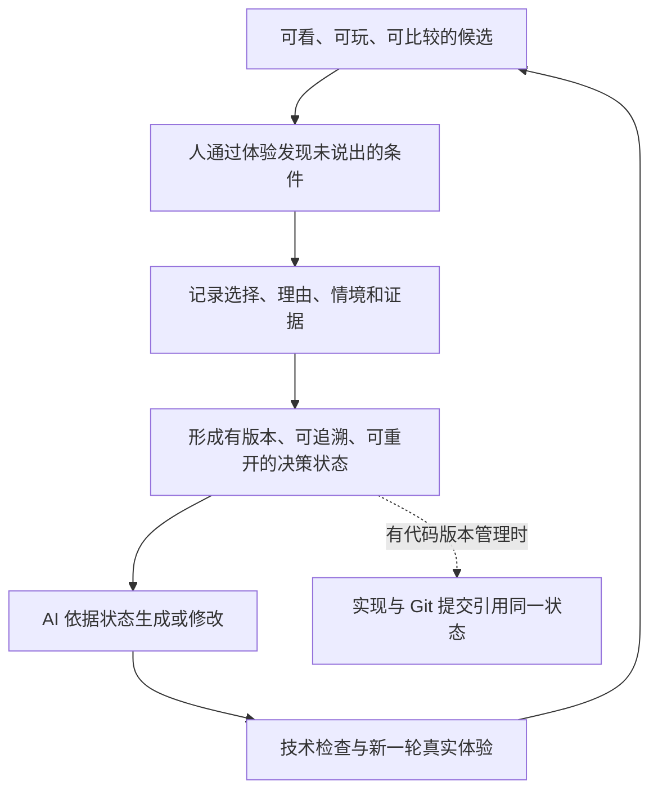
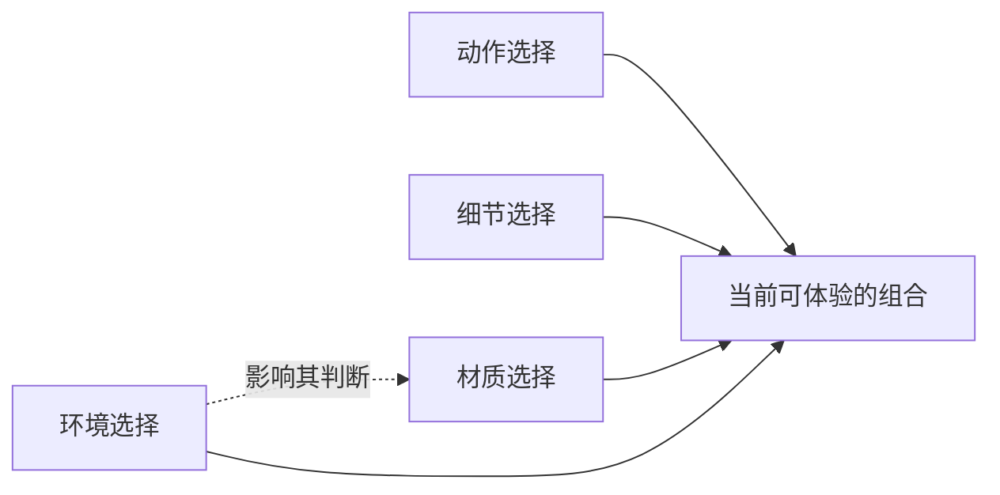

# 体验驱动意图收敛

方法暂名：体验驱动意图收敛（Experience to Intent）。

保存日期：2026-09-21。版本：0.1。方法主张由用户在本对话中提出，本文区分用户的主张、实际案例证据和待验证的推断。机械蝶是验证案例，当前工作是保存可跨项目复用的方法。

## 核心命题

**用户通过看见、试玩、比较，发现此前没有表达、甚至尚未意识到的真实条件；这些发现被记录成可追溯、可重开的决策状态，成为 AI 后续生成的约束。**

用户不需要预先掌握专业词汇，也不需要先在脑中构造完整成品。AI 负责把尚不明确的想法变成可以体验的候选，解释取舍，再把人的判断带入下一轮工作。

最短表达：

> 体验 → 判断 → 结构化意图 → 受约束的下一次生成。

“结构化意图”指把人的自然语言判断整理成后续能够使用的记录：决定了什么、在什么条件下成立、为什么这样选、依据哪次体验、哪些部分仍开放。它不要求用户填写技术表格。

完整工作循环：

Git 是记录代码变化的版本管理工具。与 Git 的关联是方法中的可选落实方式；没有代码仓库，也可以先用文件版本和变更记录建立关联。

## 精髓一：把体验作为发现需求的入口

最初的表达可以是不完整的。先给人足够具体的感受依据，允许需求在试玩中变得清楚。

静态效果能帮助判断外观；动作需要短演示；预约、取消、冲突处理等规则需要能触发后果的情境。候选的完成度应足以回答当前问题，不必先把整个产品建完。使用模拟数据或假设规则时，应让用户知道其性质。

用户的反馈可能产生三种变化：选中一个现有候选；修正对目标的理解；增加原先遗漏的条件或维度。第三种同样重要，不能把人限制在 AI 预先列出的选项里。

## 精髓二：时间向前，认识可以向前面的环节回推

每一轮都在继续推进，但人可以从一个可见结果出发，发现它暴露的错误理解，再回头补充更早阶段缺失的约束。

> 看见结果 → 发现不合意之处 → 弄清适用条件 → 修订生成依据。

“光点应在蝴蝶外部”就是体验后明确的条件。它会影响目标位置、飞行范围和取景，并不只是要求换一种图标。

## 精髓三：以可组合的决定组织候选

动作、材质、细节、环境，或者预约方式、占位规则、取消规则，可以分别成为选择维度。当前小样由其中的选择组成，不必为每个组合复制一套完整产品。

“决策图”是对选择及其关系的描述：有些选择可以组合，有些互相冲突，有些会影响另一项选择的适用性。它可以先用少量记录表达，不要求一开始就实现复杂的图形编辑器或数据库。

减法是重要的收敛动作：剪掉不需要的方向，留下合适的部分。但也必须支持补充、替换和重新打开；新发现不一定能由原有候选表达。

## 精髓四：AI 主动补充判断依据，人保留取舍权

候选旁的说明帮助用户判断，而不是替用户宣布答案：

- **得到什么**：这个方案具体带来什么体验。
- **付出什么**：会牺牲什么，在哪种情况下可能不合适。
- **可以留意什么**：一个看得见、试得出的观察点。

说明中的设计判断应与实际验证结果区分。不要要求用户先提供专业参数；“太晃”“挡住了”“想追外面的光”都可以成为有效输入。用户不必为每次直觉选择写一篇理由。

## 精髓五：冻结的是可引用的状态，决定仍可重开

一次留存至少保留：采用什么、来自哪次体验或原话、适用情境、尚未确定什么。涉及重要取舍时，再记录理由、代价和依赖关系。

状态需要区分：待体验的假设、当前采用的选择、用户明确的约束、需要复核的决定、已撤回的选择。“留下这一版”通常表示当前采用，不自动等于最终定稿。

冻结表示保存当时的可追溯版本，不表示永远不可修改。重新打开一个决定时，保留旧记录，记录改动原因，找出受影响的判断；已知无关的选择继续保留。

尤其要区分：

- **人的判断**：光点应在主体外部，不能遮挡观察。
- **AI 的实现假设**：暂时保持某个距离，使用某种光晕大小。

后者可以帮助体验前者，但不能自动获得“用户已确认”的身份。

## 精髓六：决策状态要对后续工作发生作用

下一次生成前，AI 应读取当前状态，知道哪些要继续遵守、哪些允许探索、这轮准备改变什么。生成后，应能说明依据了哪些决定、哪些受到影响、是否存在偏离。

有代码版本管理时，代码提交引用同一决策状态，便于从一个实现追溯到它响应的判断。一个决定可以经过多次实现，一个提交也可以响应多个决定；不需要为每个选项或组合创建一个 Git 分支。

状态不能同时满足时，应把冲突转化为具体情境让人判断。常规实现细节由 AI 推进，不把每一步都变成审批。

## 为什么没有明显感到分支压力

【已确认】用户在机械蝶的实际体验中明确表示没有感受到分支爆炸压力。这是当前案例中的主观体验。

【推断】可能的原因是用户始终面对一个熟悉的小样，每次只比较少量相关变化；已采用的部分充当基线，其他方向可以暂时收起。组合总数仍然很大，但不必同时占据用户的注意力。

【不确定】复杂度并未因此消失。维度之间的影响、旧决定失效、候选增加后的判断负担，都需要后续验证。不能把当前体验推成对所有复杂业务都成立的结论。

【建议】按当前问题展开少量有意义的候选，逐步显露相关关系；不预先生成所有组合，也不把某次示例中的候选数量固定成通用要求。

## 当前证据与方法边界

【已确认】对话和机械蝶案例支持“体验产生新条件”“不同维度可以组合”“解释取舍有助于反馈”。用户提供的预约规则截图进一步说明了业务情境体验的设想，但我们没有在本项目中验证该预约系统的实现。

【推断】带着明确基线和反馈修订已有结果，有望减少后续生成中的自由猜测与重复纠正。生成成本较低，是探索这种工作方式的动机；并不意味着所有成本都低。

【不确定】稳定提升幅度、适用项目范围、协作规模、方法独创性和市场差异尚未证明。当前机械蝶程序主要保存选项、缩略图和文字，没有实现自动强制约束后续生成、完整决策图管理或 Git 绑定。

【建议】评价方法时重点观察：是否发现了原先未表达的条件；用户能否理解正在取舍什么；重要判断是否在后续保持有效；是否减少重复纠正；重新打开决定时能否定位影响。候选越多、交互越频繁，并不自动代表效果越好。

## 复用入口

可以把下面这段话带到新的 AI 编程任务中：

> 请按“体验驱动意图收敛”方式推进。先把我尚不明确的想法变成可看、可玩、可比较的小样，在旁边解释收益、代价和观察点。让我通过体验发现条件；由你把反馈整理成可追溯、可重开的决策状态，作为下一轮生成的约束。保留已经表达清楚的选择，只展开当前相关的问题。没有被候选覆盖的想法也要能加入。不要把默认值、我的沉默或你补出的实现参数当成我已经确认的要求。

AI 的操作入口见 [技能入口](../SKILL.md)。记录格式见 [决策状态模板](决策状态-DecisionState.md)。原始案例与证据强度见 [案例证据](案例证据-CaseEvidence.md)。

保存约定：本目录是方法的可携带源稿；安装到本机技能目录的是同内容副本。普通文档采用中文加英文文件名；`SKILL.md` 和 `agents/openai.yaml` 保留技能工具要求的固定入口名称。
